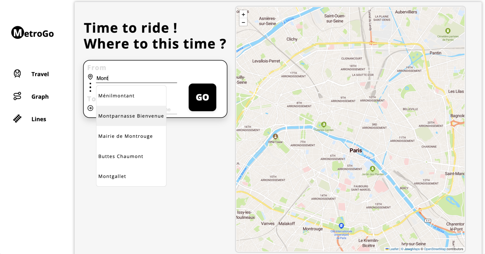
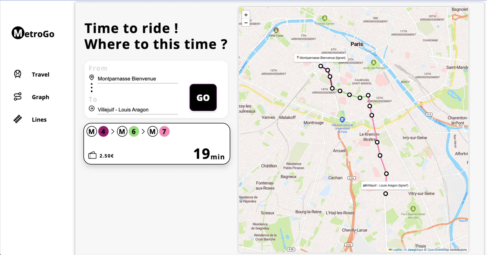
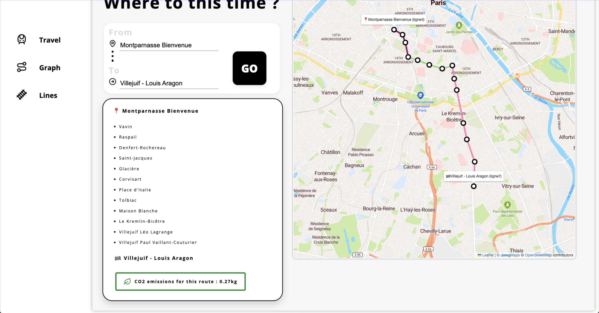
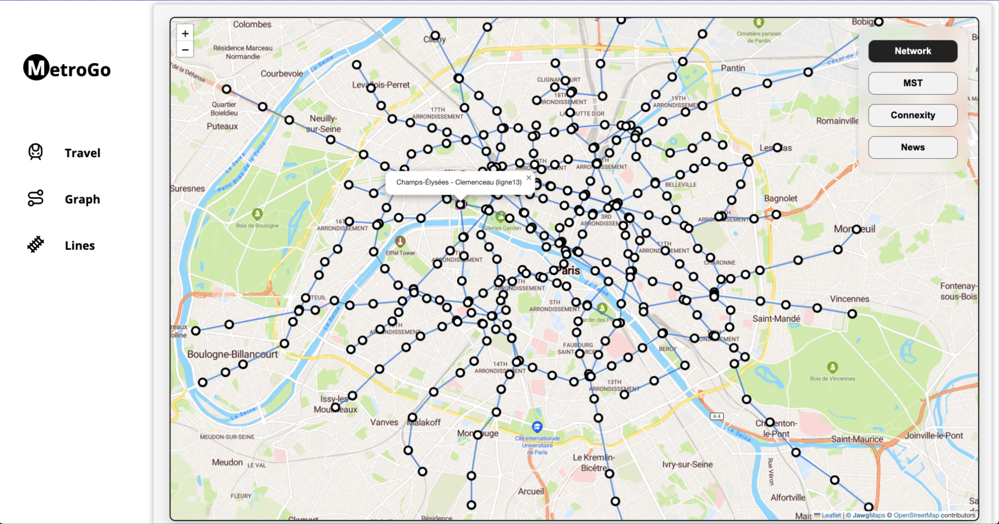

# 🚇 MetroGo

**MetroGo** is a modern, interactive web application that helps users compute optimal routes across the Paris metro network.

Built with **Vue.js**, **FastAPI**, and **SQLite**, it combines real-time UI, graph algorithms, and real-world metro data to simulate transit routing, analyze network connectivity, and visualize station relationships.

---

## 🖼️ Preview






---

## 🚀 Features

- **Shortest Path Computation**  
  Calculate and display the shortest route between two stations using Dijkstra’s algorithm.

- **Minimum Spanning Tree (ACPM)**  
  Visualize the metro network as a tree using Prim or Kruskal algorithms.

- **Network Connectivity Check**  
  Verify whether the entire metro network is connected (i.e., every station can be reached from any other).

- **Real Paris Metro Data Integration**  
  Uses actual 2024 metro data for realistic and accurate path planning.

---

## 🛠 Technologies Used

- 
- 
- 
- 
- 
- 
- 

---

## 📦 Getting Started

To run this project locally:

```bash
git clone https://github.com/chealeanpenhchakrith/MetroGo.git
cd Paris-Metro-Route-Planner
cd Back-End
uvicorn main:app --reload
cd ../Front-End
npm install
npm run dev
